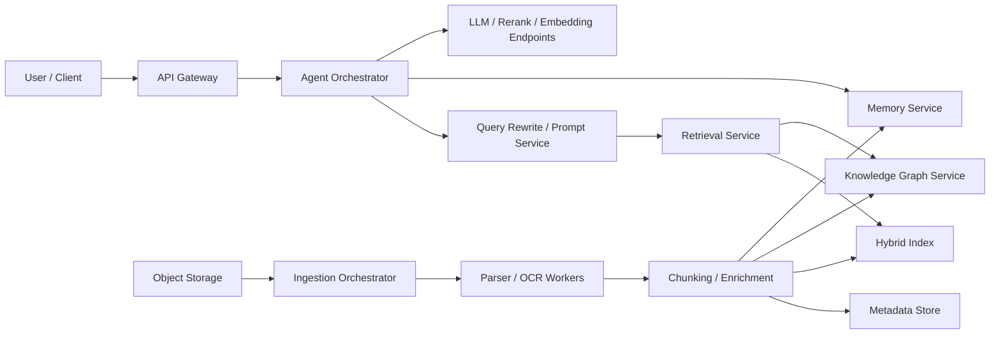

# Assignment 4 - Architectural Analysis of RAGFlow

This report uses RAGFlow as the main reference system, while trying to generalize the discussion to RAG + Agent systems more broadly.

## 1. Deep document understanding vs naive chunking

RAGFlow's emphasis on deep document understanding makes sense because enterprise documents are rarely plain text. They contain headings, tables, footnotes, page structure, and metadata. A fixed-size chunker treats all of that as one token stream, so it often breaks the unit that actually matters for retrieval, such as a table row, a legal clause, or a section title.

Deep document understanding improves retrieval fidelity because the index preserves units that humans also see as meaningful. If the parser recovers section hierarchy, table boundaries, page references, and metadata, retrieval can match against a cleaner unit of meaning instead of against arbitrary token windows.

It also changes index design. With naive chunking, the index is basically a flat list of text chunks. With layout-aware parsing, the index becomes multi-layered: section text, table text, titles, metadata, page numbers, and sometimes parent-child links.

The main trade-off is preprocessing cost. Layout-aware parsing needs OCR, structure recovery, parser selection, and post-processing. It is slower and more expensive, and it can fail on noisy PDFs. Naive chunking is still fine for clean text corpora, but for enterprise RAG the extra parsing cost is usually worth it.

## 2. Chunking strategy: template vs semantic

Template-based chunking and semantic chunking fail in different ways because they assume different things about the data. Template chunking assumes the document has a useful structure that should be preserved. Semantic chunking assumes the important boundaries are topic shifts in embedding space.

Template-based chunking is usually better for highly structured documents such as financial reports, policies, manuals, or contracts. In those settings, the structure itself carries meaning, so preserving section and table boundaries helps both retrieval and attribution.

Its failure mode appears in loosely structured corpora such as chat logs or mixed email threads, where one reliable layout pattern does not really exist.

Semantic segmentation has the opposite strength. It works better when the document is unstructured but still locally coherent. But on highly structured documents it can merge text that looks semantically similar while actually belonging to different sections or tables.

So the best design is usually hierarchical: template-first when the document has strong structure, and semantic refinement inside the recovered sections when those sections are still too long.

## 3. Hybrid retrieval architecture

Hybrid retrieval improves both recall and precision because lexical and vector retrieval fail on different subsets of queries. BM25-like retrieval is strong on exact anchors such as identifiers, version numbers, or rare keywords. Vector retrieval is strong when the user asks in paraphrased language that does not literally overlap with the indexed text. Combining them improves recall, and reranking then improves precision.

Concrete failure cases:

- Lexical-only retrieval fails on paraphrase and semantic gap. A user may ask "How do we revoke access after offboarding?" while the document says "deprovision credentials upon employee termination." BM25 may miss it because the exact terms differ.
- Vector-only retrieval fails on exact tokens and fine distinctions. Queries about part numbers, API field names, regulations, or small wording changes such as "must" vs "must not" are often better handled by lexical matching.
- Hybrid retrieval still has edge cases. If both retrieval branches pull in broadly related but non-answer-bearing chunks, the reranker may still choose the wrong candidate. This happens with repetitive boilerplate, near-duplicate pages, or corpora where many chunks mention the same high-level concept.

Hybrid retrieval is not a cure-all, but it reduces the blind spots of any single retriever. The cost is higher latency, more tuning, and more debugging work.

## 4. Multi-stage retrieval pipeline

A multi-stage retrieval pipeline is superior to a single-pass ANN search because relevance is too expensive and too context-dependent to compute in one shot. ANN search is good at quickly finding nearby vectors, but production RAG usually needs more than that: keyword matching, metadata filters, reranking, query rewriting, and sometimes graph or page-index expansion.

Candidate generation should be cheap and recall-oriented. That is why RAGFlow first retrieves a larger set using weighted keyword and vector signals. Re-ranking can then use a more expensive model on a much smaller pool.

The main benefit is a better recall/latency trade-off. Instead of paying the highest compute cost on the whole corpus, the system spends cheap compute on broad recall and expensive compute only on shortlisted candidates.

The main risk is cascading error propagation. If stage 1 never retrieves the right chunk, no reranker can recover it later. If the query rewrite drifts away from the user's intent, every later stage becomes worse too. So multi-stage pipelines need guardrails such as larger candidate pools, fallback to the original query, and retrieval tests.

## 5. Indexing strategy and storage backends

Backend choice should follow workload, not fashion. I would evaluate a backend using query mix, metadata filtering needs, update frequency, explainability requirements, operational complexity, and cost per query.

| Backend | Strengths | Weaknesses | Best-fit workloads |
| --- | --- | --- | --- |
| Elasticsearch-like hybrid store | Strong full-text search, filters, faceting, decent hybrid retrieval, mature ops tooling | Vector support is improving but still not as specialized as a vector-native system for some workloads | Enterprise search, compliance search, document QA with heavy metadata filters |
| Vector-native DB | Fast ANN, strong semantic retrieval, often better support for multi-vector or multimodal retrieval | Weak exact matching, sometimes weaker filtering and explainability | Semantic search, FAQ retrieval, high-QPS embedding-based assistants |
| Graph-augmented store | Strong for entity-centric traversal, multi-hop reasoning, provenance, and explainable paths | Expensive graph construction, noisy entity linking, harder ops model | Investigations, supply chain, fraud, legal reasoning, dependency analysis |

RAGFlow's design suggests a layered view instead of a one-backend view. Its retrieval stack already mixes full-text, vector similarity, reranking, and optional graph retrieval. So the real question is not which store is best overall, but which store should handle which retrieval subproblem. In practice:

- Elasticsearch-like backends win when keyword precision and filters matter.
- Vector-native systems win when the query language is loose and semantic.
- Graph stores win when the answer requires explicit relation traversal rather than fuzzy similarity.

## 6. Query understanding and reformulation

Query transformation is critical in RAG because users rarely write retrieval-optimized queries. They use shorthand, pronouns, vague references, or multi-part questions. The corpus may use a different vocabulary, language, or level of detail. That mismatch is the semantic gap.

Static query-to-retrieval is still useful. It is cheap, deterministic, and easy to debug. For simple fact lookup, a direct query is often the best choice because it avoids rewrite drift.

Iterative query refinement is better for hard questions: decomposing a multi-hop request into subqueries, expanding abbreviations, translating cross-language terms, or separating retrieval from reasoning. Agent-driven refinement is especially useful when the first retrieval pass is weak, because the agent can inspect partial evidence and then ask a better second question.

But refinement has real failure modes. It adds token cost and latency, and it can over-expand a precise query into something too broad. In the worst case, the agent rewrites the question into a different question. Because of that, I would keep the original query as a control path and cap the number of rewrites.

## 7. Knowledge representation layer

Dense vectors, relational schema, and knowledge graphs solve different retrieval and reasoning problems.

| Representation | Best property | Weak point | Effect on compositional reasoning | Effect on explainability |
| --- | --- | --- | --- | --- |
| Dense vector space | Strong fuzzy matching and semantic recall | Weak explicit structure | Weak for exact multi-step composition | Low; similarity is hard to explain |
| Relational schema | Precise joins, filters, constraints | Rigid schema, weak on free text | Good when the question maps to known tables/keys | High; results can be traced to rows and joins |
| Knowledge graph | Explicit entities and edges, multi-hop traversal | Expensive extraction, entity-linking noise | Strongest for relation-based composition | High; paths and subgraphs are human-readable |

For compositional reasoning, vectors are usually the weakest because they compress many relations into one similarity space. Relational systems are stronger when the world is already tabular and the joins are known. Knowledge graphs are strongest when the question asks for entity relationships, dependencies, or multi-hop reasoning.

For explainability, dense retrieval is the weakest because similarity scores are hard to interpret. Graphs and relational schemas are much easier to justify. So again I think the best production design is layered: vectors for high-recall retrieval, and structured representations for verification and explanation.

## 8. Data ingestion pipeline architecture

A robust ingestion system should be designed as a pipeline, not as one large parse-and-index job. I would decompose it into connectors, normalization, parsing, enrichment, chunking, indexing, and validation.

Schema normalization is the first hard problem. Different sources have different fields, timestamps, permissions, and update patterns. I would normalize them into a canonical document envelope with fields such as `source_id`, `tenant_id`, `document_id`, `version`, `acl`, `mime_type`, `created_at`, `updated_at`, `title`, and extracted text or metadata.

Incremental indexing should be content-aware. A practical strategy is to hash documents and chunks, store version metadata, and only re-embed chunks whose normalized content changed. Deletes should produce tombstones so retrieval does not serve stale results.

The core trade-off here is consistency vs throughput. Synchronous indexing gives stronger freshness guarantees, but it slows ingestion and couples the ingestion path too tightly to serving. Asynchronous micro-batch indexing improves throughput and failure isolation, but introduces eventual consistency. For an enterprise RAG system, I would prefer bounded staleness with retries and explicit freshness SLAs.

## 9. Memory design in RAG systems

Memory should not be treated as one thing. Different memory types serve different control problems.

| Memory type | Main use | Strength | Weakness |
| --- | --- | --- | --- |
| Vector memory | Semantic recall of prior interactions | Good for fuzzy recall and long-range association | Weak temporal ordering and weak conflict resolution |
| Structured memory (SQL/graph) | Preferences, slots, tasks, tool state | Precise, controllable, easy to validate | Requires schema design and ongoing maintenance |
| Episodic logs | Time-ordered traces of what happened | Strong auditability and replay | Grows quickly and is hard to search semantically without another layer |

Vector memory is useful when the agent needs to remember semantically similar past interactions, but it easily accumulates noise. Structured memory is best when the system must reliably remember facts such as preferences or workflow state. Episodic logs are necessary for temporal reasoning and debugging because they preserve what happened and when.

Modern systems end up needing all three because memory is really mixing at least three different jobs: recall, state management, and audit. RAGFlow's recent release notes show this pretty clearly. Memory appears as an explicit interface in v0.23.0 and then gets stability fixes in v0.23.1.

My preferred design is layered. Keep episodic logs as the source of truth, extract structured memory for stable facts and task state, and use vector memory as a lossy semantic cache over the long history.

## 10. End-to-end system decomposition

If I were decomposing RAGFlow into microservices, I would separate ingestion, retrieval, reasoning, and state management. The goal is to scale different bottlenecks independently and isolate failure so that one weak subsystem does not take down the whole stack.

### Stateless vs stateful services

Stateless services:

- API gateway / auth layer
- Agent orchestration service
- Query rewrite / prompt assembly service
- Parser workers and OCR workers
- Embedding / rerank inference workers if they are deployed behind autoscaled model endpoints

Stateful services:

- Object storage for raw files
- Metadata store for document, chunk, and ACL metadata
- Hybrid retrieval index
- Graph store / graph index
- Memory store
- Queue / workflow state store
- Session store

### Scaling strategy

- Parsing and OCR should scale by document backlog and document type because scanned PDFs are much more expensive than clean text.
- Retrieval should scale by query-per-second and tail-latency targets.
- Rerank and embedding endpoints should scale by token throughput.
- Agent orchestration should scale by concurrent conversations and tool invocations.
- Graph retrieval should scale separately because its query profile is usually lower-QPS but more expensive per request.

### Failure isolation boundaries

- Ingestion should be isolated from serving. A broken parser should not block chat.
- Graph retrieval should be optional. If graph retrieval fails, the system should fall back to hybrid text retrieval.
- Reranking should degrade gracefully. If the reranker is unavailable, the system can still answer with hybrid retrieval only.
- Memory failure should not block the whole agent. The agent should fall back to short-window conversation state.

One reasonable decomposition is:

This design keeps online query handling mostly stateless while leaving state in specialized backends. To me, that is the cleanest way to balance scale, latency, and failure isolation in a production RAG platform.

## References

1. Assignment 4 prompt: https://aegean.ai/aiml-common/assignments/main/ai-spring-2026/assignment-4
2. RAGFlow repository README: https://github.com/infiniflow/ragflow
3. RAGFlow dataset configuration guide: https://github.com/infiniflow/ragflow/blob/main/docs/guides/dataset/configure_knowledge_base.md
4. RAGFlow retrieval test guide: https://github.com/infiniflow/ragflow/blob/main/docs/guides/dataset/run_retrieval_test.md
5. RAGFlow retrieval component reference: https://github.com/infiniflow/ragflow/blob/main/docs/guides/agent/agent_component_reference/retrieval.mdx
6. RAGFlow releases: https://github.com/infiniflow/ragflow/releases
7. Infinity repository overview: https://github.com/infiniflow/infinity
